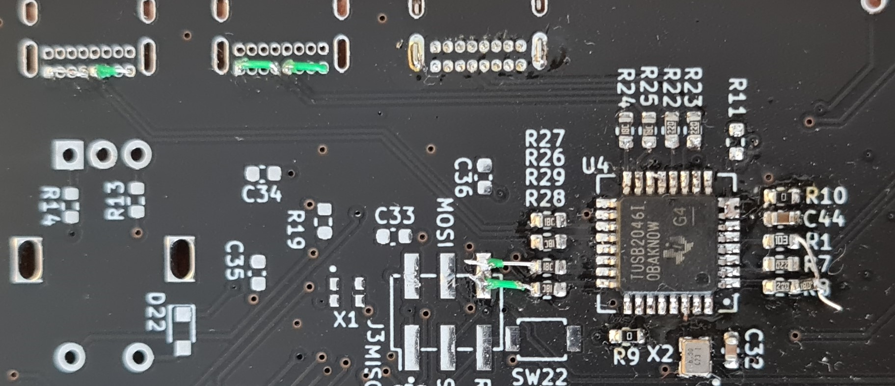

## Macropad v0 issues

 

1. I2C lines connected incorrectly to ATMEGA32U4

The I2C lines are not connected to the dedicated I2C hardware pins PD1 and PD0 on the ATMEGA32U4. The OLED display cannot be driven on the v0 board.

*Fixes:* Cannot be fixed in hardware as the dedicated I2C pins are used to drive the switch matrix.

2. USB configuration resistors not connected correctly

Pull up/down resistors are required to be placed on the USB data lines to set the port directions on startup. Some USB HUB chips include these resistors in the package to simplify hardware design however the TUSB2046 does not include these and they need to be placed externally. AN-5052 provides a guide on how to correctly configure the USB data lines for host/peripheral configurations.

*Fixes:* 
 
To use the USB HUB, the 1K5 resistor can be soldered between R1 and R8. The 15K pull down resistors can be soldered between USB data lines and ground at the downstream connectors.
 
 

     

 
If the USB HUB is not required, the TUSB2046 can not be placed and the USB data lines can be connected directly to the ATMEGA32U4 by joining pins 1 and 24, and pins 2 and 23 on the TUSB2046 footprint with wire.
 

     

